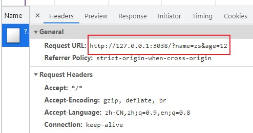
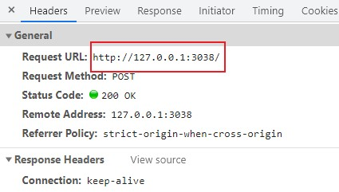

# 1.原生ajax

> 使用 **Ajax**，我们可以无刷新状态更新页面，并且实现异步提交，提升了用户体验。.

### 1.1 ajax是什么？

​      Ajax的核心是JavaScript对象XmlHttpRequest，XmlHttpRequest使您可以使用

​      JavaScript向服务器提出请求并处理响应，而不阻塞用户。

​      通过XMLHttpRequest对象，Web开发人员可以在页面加载以后进行页面的局部更新

### 1.2 ajax作用是什么？

​      （1）通过异步模式，提升了用户体验

​      （2）Ajax可以实现动态不刷新（局部刷新）就是能在不更新整个页面的前提下维护数据。

​       这使得Web应用程序更为迅捷地回应用户动作，并避免了在网络上发送那些没有改变过的信息

### 1.3  ajax创建请求步骤

get请求

​      1. 创建一个对象

​      2. 设置请求参数

​      3. 发送请求

​      4. 监听请求成功后的状态变化

post请求

​      1. 创建一个对象

​      2. 设置请求参数

​      3. 设置请求头

​      4. 发送请求

​      5. 监听请求成功后的状态变化

### 1.4 ajax get和post请求的区别

1. **使用Get请求时,参数在URL中显示,而使用Post方式,则不会显示出来**

   get请求

   

   post请求

   

2. 使用Get请求发送数据量小,因为浏览器url有长度限制,而Post请求发送数据量大

3. **GET请求能够被cache，POST不进行缓存**。GET请求能够被保存在浏览器的浏览历史里面（密码等重要数据GET提交，别人查看历史记录，就可以直接看到这些私密数据）

4. GET产生一个TCP数据包；POST产生两个TCP数据包。

   对于GET方式的请求，浏览器会把http header和data一并发送出去，服务器响应200（返回数据）；

   而对于POST，浏览器先发送header，服务器响应100 continue，浏览器再发送data，服务器响应200 ok（返回数据）。


# 2.封装ajax

手撕ajax代码

```javascript
 function AJAX(type, url, data, success, failed) {
            // 创建 xhr对象
            let xhr = null
            if (window.XMLHttpRequest) {
                xhr = new XMLHttpRequest()
            } else { // 兼容ie
                xhr = new ActiveXObject('Microsoft.XMLHTTP')
            }
            type = type.toUpperCase()
            let random = Math.random() // 用于清除缓存
            if (typeof data === 'object') {
                // 拼接字符串
                let str = ''
                for (let key in data) {
                    str += key + '=' + data[key] + '&'
                }
                data = str.replace(/&$/, '')
            }
            if (type === "GET") {
                if (data) {
                    xhr.open(type, url + '?' + data)
                } else {
                    xhr.open(type, url + '?t=' + random)
                }
                xhr.send()
            } else if (type === 'POST') {
                xhr.open(type, url)
                xhr.setRequestHeader('Content-type', 'application/x-www-form-encoded')
                xhr.send(data)
            }
            // 处理返回的数据
            xhr.onreadystatechange = function () {
                if (xhr.readyState === 4) {
                    if (xhr.status === 200) {
                        success(xhr.responseText)
                    } else {
                        if (failed) {
                            failed(xhr.status)
                        }
                    }
                }
            }
        }

```

